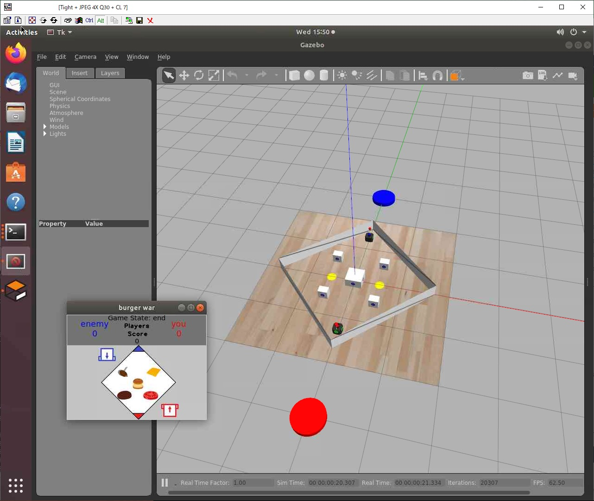

# Change log
- 2021/02/10
  - 作成
  ‐ noVNCについて追記




# aws ec2におけるROS開発環境構築

aws ec2は、仮想サーバーが構築できるクラウドサービスであるが、
GPUが使用できるインスタンスタイプがあり、開発環境としても有用である。

Ubuntuをインストールし、VNCを使用することで、
ローカルPCと同じ感覚の開発環境を構築できる。

また、クラウドであるので
ハイパフォーマンスな環境をどこからでも使用できる。
また、同時に複数のインスタンスを起動することができるため、
並列して複数条件でシミュレーションを実行することもできる。

この文書では、aws ec2の上でROS開発環境を構築する手順を解説する。

## インスタンスを起動
まず、事前にリージョンを選択しておく。下記は全て東京リージョンでのみ動作を確認している。
EC2ダッシュボードで、インスタンスを起動をクリックする。

### AMIを選択
下記のAMIを探し、`選択`をクリック

`Ubuntu Server 18.04 LTS (HVM), SSD Volume Type`/`64-bit (x86)`


### インスタンスタイプを選択
`g4dn.xlarge`もしくは`g4dn.*xlarge`を選ぶ。
`g4dn.4xlarge`で一般的な用途では十分なパフォーマンスがでる。
`確認と作成`をクリックする。

### ストレージの編集
`ストレージの編集`をクリックする。

ストレージのサイズを入力する。
20 (GiB)程度は必要である。

`確認と作成`をクリックする。

### 起動
`起動`をクリックする。

ここでキーペアの選択が必要である。
これはインスタンスのアクセスのために重要な選択である。

`既存のキーペアの選択`もしくは`新しいキーペアの作成`を選択する。

`インスタンスの表示`をクリックする。

## SSH経由でインスタンスに接続する

Windows上のSSHクライアントソフトを使用できる。
（`Tera Term` , `Putty`など）

パブリックIPv4 IPアドレス をEC2インスタンスダッシュボードから取得する。

TeraTermの設定は下記の通り。

1. IPアドレスを入力
2. SSHを選ぶ
3. OKを押す.
4. ユーザーネーム入力: `ubuntu` (パスワードはempty.)
5. `RSA/DSA/ECDSA/ED25519 key to login`を選ぶ
6. private key fileを選ぶ (*.pem)

## NVIDIAドライバーのインストール
### アップグレード

```
sudo apt update -y
sudo apt upgrade -y linux-aws
# もしここで grub の dialogが表示された場合、下記を参照

sudo reboot

```

場合によってはGrubのアップデートに関するダイアログが表示される。
(もし表示されなければ下記はスキップ)

Grubをインストールするデバイスを選ぶ。Amazon Elastic Block Storeを選ぶ.
```
Package configuration

    lqqqqqqqqqqqqqqqqqqqqqqqu Configuring grub-pc tqqqqqqqqqqqqqqqqqqqqqqqk
    x GRUB install devices:                                               x
    x                                                                     x
    x    [ ] /dev/nvme0n1 (125000 MB; Amazon EC2 NVMe Instance Storage)   x
    x    [x] /dev/nvme1n1 (21474 MB; Amazon Elastic Block Store)          x
    x    [ ] - /dev/nvme1n1p1 (21473 MB; /)                               x
    x                                                                     x
    x                                                                     x
    x                               <Ok>                                  x
    x                                                                     x
    mqqqqqqqqqqqqqqqqqqqqqqqqqqqqqqqqqqqqqqqqqqqqqqqqqqqqqqqqqqqqqqqqqqqqqj
```

Grubの設定がコンフリクトしているとメッセージが出る。
`keep the local version currently installed`を選ぶ。
```
Package configuration
    lqqqqqqqqqqqqqqqqqqqqqqqqqqqqqqqqqu  tqqqqqqqqqqqqqqqqqqqqqqqqqqqqqqqqqk
    x A new version of /boot/grub/menu.lst is available, but the version   x
    x installed currently has been locally modified.                       x
    x                                                                      x
    x What would you like to do about menu.lst?                            x
    x                                                                      x
    x     install the package maintainer's version                         x
    x     keep the local version currently installed                       x
    x     show the differences between the versions                        x
    x     show a side-by-side difference between the versions              x
    x     show a 3-way difference between available versions               x
    x     do a 3-way merge between available versions (experimental)       x
    x     start a new shell to examine the situation                       x
    x                                                                      x
    x                                                                      x
    x                                <Ok>                                  x
    x                                                                      x
    mqqqqqqqqqqqqqqqqqqqqqqqqqqqqqqqqqqqqqqqqqqqqqqqqqqqqqqqqqqqqqqqqqqqqqqj

```

### NVIDIA driverインストール

```
sudo apt-get install -y gcc make linux-headers-$(uname -r)
sudo apt-get install -y pkg-config

# https://docs.aws.amazon.com/ja_jp/AWSEC2/latest/UserGuide/install-nvidia-driver.html#public-nvidia-driver
# これはawsへのNVIDIAドライバーのインストール手順を示した公式ドキュメントである。
# このドキュメントは頻繁にアップデートされるので、常に最新のドキュメントをチェックする。
# 下記の手順は「パブリック NVIDIA ドライバー」を使用している。


wget https://us.download.nvidia.com/tesla/450.80.02/NVIDIA-Linux-x86_64-450.80.02.run
chmod +x NVIDIA*.run
sudo ./NVIDIA*.run
```
インストールダイアログが開く。
[Continue installation]を押す。
[WARNING]が表示されるが, OKを押していく.


xorg.conf生成.
```
sudo nvidia-xconfig -a --virtual=1280x1024 --allow-empty-initial-configuration --enable-all-gpus --busid PCI:0:30:0
```
`PCI:0:30:0` はPCIのbusidである。
busid は`nvidia-xconfig --query-gpu-info`で確認できる。

Linux kernel driverのblacklistを追記する。これによりオープンソースのドライバーが無効化される。
```
cat << EOF | sudo tee --append /etc/modprobe.d/blacklist.conf
blacklist vga16fb
blacklist nouveau
blacklist rivafb
blacklist nvidiafb
blacklist rivatv
EOF
```

ブートローダーのオプションを追記する。
```
cat << EOF | sudo tee --append /etc/default/grub
GRUB_CMDLINE_LINUX="rdblacklist=nouveau"
EOF
```

ブートローダーを更新し、再起動する。
```
sudo update-grub

sudo reboot
```
### Swap の設定
aws ec2ではSwapは標準では有効ではない。
そのため、Swapを有効にする必要がある。

SwapはEphemeral Diskに作成する。一時保存領域であり再起動の度に初期化される領域だが高速なアクセスが可能でありSwapに向いている。

まず、Ephemeral Diskのデバイスファイル名を確認する。
例えば、`/dev/nvme1n1` がEphemeral Diskである。
このデバイスファイル名は、変わることがあるので注意が必要である。

下記のコマンドで、Ephemeral diskを確認できる。
```
lsblk
```
インスタンスにアタッチされている全てのDiskを確認できる。
```
NAME        MAJ:MIN RM   SIZE RO TYPE MOUNTPOINT
loop0         7:0    0  28.1M  1 loop /snap/amazon-ssm-agent/2012
loop1         7:1    0  96.6M  1 loop /snap/core/9804
nvme1n1     259:0    0 116.4G  0 disk
nvme0n1     259:1    0    20G  0 disk
  nvme0n1p1 259:2    0    20G  0 part /
```
上記の例では, `nvme1n1` がEphemeral Diskである.

次にSwapファイルを作成するサービスを追加する。
上記の通りSwapファイルはEphemeral disk上につくる。
```
cat << EOF | sudo tee /etc/systemd/system/swap.service
[Unit]
Description=SWAP Enabling
[Service]
Type=oneshot
Environment="MNT_PATH=/mnt" "SWAP_FILE=swapvaol" "DISK_DEV=/dev/nvme1n1"
ExecStartPre=/sbin/wipefs -fa \${DISK_DEV}
ExecStartPre=/sbin/mkfs -t ext4 \${DISK_DEV}
ExecStartPre=/bin/mount -t ext4 \${DISK_DEV} \${MNT_PATH}
ExecStartPre=/bin/sh -c "/usr/bin/fallocate -l 32GB \${MNT_PATH}/\${SWAP_FILE}"
ExecStartPre=/bin/chmod 600 \${MNT_PATH}/\${SWAP_FILE}
ExecStartPre=/sbin/mkswap \${MNT_PATH}/\${SWAP_FILE}
ExecStart=/sbin/swapon \${MNT_PATH}/\${SWAP_FILE}
ExecStop=/sbin/swapoff -a
RemainAfterExit=true
[Install]
WantedBy=multi-user.target
EOF

sudo systemctl daemon-reload
sudo systemctl enable swap.service
sudo systemctl start swap.service
```
上記では`32GB`に設定している。

### Desktop環境をインストール
```
sudo apt install -y ubuntu-desktop xterm x11vnc
```

### ifupdownをPurgeする
```
sudo apt purge ifupdown
```
これは、aws が`netplan`を使っているのに対して、 `ubuntu-desktop` が `ifupdown`を
インストールしてしまうためである。このコンフリクトによって、ネットワークが無効になってしまい、インスタンスにアクセスできなくなってしまうため、
ここで `ifupdown`をPurgeする。

### Display manager を lightdm に変更
```
sudo apt install lightdm
# 選択画面が出るので lightdmを選ぶ
```
Ubuntu 18.04 では デフォルトの Display Manager が gdm3 になっている。
gdm3はx11vncと相性が悪く動作しない。そのためlightdmに変更している。


### Reboot
```
sudo reboot
```


### x11vnc の設定
VNC server の自動起動の設定をsystemdに追加する。

```
cat << EOF | sudo tee /etc/systemd/system/x11vnc.service
[Unit]
Description=VNC Server
After=multi-user.target network.target

[Service]
Restart=always
ExecStart=/usr/bin/x11vnc -xkb -noxrecord -noxfixes -noxdamage -display :0 -auth /var/run/lightdm/root/:0 -rfbport 5900 -forever -loop -repeat -shared

[Install]
WantedBy=multi-user.target
EOF

sudo systemctl daemon-reload
sudo systemctl enable x11vnc.service
sudo systemctl start x11vnc.service
```

### passwordを設定
デフォルトのユーザー`ubuntu`はパスワードを持っていない。
（キーファイル認証のため）
しかし、ログインスクリーンやその他の設定画面ではパスワードが要求される。
そこで、パスワードを設定しておくと良い。
```
sudo passwd ubuntu
```


## VNCでスクリーンに接続
TeraTermで、SSHポート転送を設定する。

1. Tera Termのウインドウメニューで、Setup -> SSH Forwarding
2. Add...をクリック
3. 下記の通り入力
- Local port : 5900
- listen : (empty)
- remote machine : (empty)
- Remote port : 5900

VNC ClientをローカルPCにインストールする。
（WindowsでのおすすめはTurboVNC）

VNCクライアントを起動し,
`localhost:0` とVNCクライアントソフトに入力すると、デスクトップが表示される。
(
 `Remote port : 5900`と`localhost:0`は同じポート番号を示している。
 ポート番号`5900` → VNC画面番号`0` , 5901 → 1 となる。複数のインスタンスに1台のPCから同時に接続する場合、ポート番号を変えれば接続できる。
)

## 開発環境のインストール
以上で基本的なセットアップは完了している。
別途必要な開発環境(ROSなど)は、通常の手順と同様にインストールできる。

セットアップが完了した環境は、AMIにして残しておくと、環境を簡単に複製できる。
下記にその手順を示している。

また、良く利用するソフトウェアと、おすすめの設定方法を下記で紹介している。

## AMI Image の作成
 AMI Imageを作成するときに, いくつか準備が必要である。
[Reference]( https://hirose31.hatenablog.jp/entry/2019/06/17/182154 )

環境構築が終わったインスタンスに入り、下記を実行しておく。
```
sudo apt purge ifupdown
: | sudo tee /etc/machine-id
```

インスタンスを停止し、AMIをつくりたいインスタンスを右クリックし、イメージを作成をクリックする。
数分で作成は完了する。

AMIからのインスタンスの生成は、下記の手順である。

1. EC2管理画面のAMI一覧ページに入る
1. AMIを右クリックし起動をクリックする
1. インスタンスタイプを選ぶ(`g4dn.*xlarge` AMI作成したのと同じタイプでなくてもよい)
1. 確認と作成をクリック
1. 起動をクリックし、キーペアを選択する

初回起動のみ若干時間を要する。（1-2分）

## 追加的なおすすめのインストール
```
sudo apt install simplescreenrecorder terminator
sudo apt-get install ubuntu-restricted-extras
```
- simplescreenrecorder 画面キャプチャソフト。簡単で高性能。
- terminator 画面を分割できる端末ソフト。
- ubuntu-restricted-extras 動画デコーダーなどが入っている。simplescreenrecorderで録画したファイルを再生するのに必要。

## Ubuntuのおすすめの設定

スタートメニューから, `Settings`を検索する

- Notifications
   - Notification Popups - OFF
   - Lock Screen Notification - OFF
- Privacy
   - Screen Lock - OFF
   - Screen LockでVNCが切れることがあるため
- Power
   - Blank screen - Never
   - VNCが切れることがあるため
- Details
   - Date & Time
      - Time Zone - JST ( Tokyo, Japan)
   - Users
      - Automatic Login - ON  (Push `Unlock` button)
      - 自動ログインのほうがVNCが安定する

いくつかの設定ではパスワード入力が要求される。
上記の通りパスワードを設定しておかなければいけない。


# FAQ
## インスタンスはどうやって停止すればよいか？
下記の度の手順でもかまわない。
- ターミナルで`sudo shutdown -h now`
- デスクトップの右上メニューからShutdown
- EC2のインスタンス一覧画面から「インスタンスを停止」

EC2の「インスタンスを終了」はインスタンスの削除を意味するので注意。

## VNCの解像度は変更できるか？
できる。UbuntuのSettings->Devices->Displayから選択・変更ができる。

## マルチモニターはできるか？
できない。VNCはマルチモニターに非対応と思われる。
`VSCode Remote Development`を使うと、SSH経由でソースコードの編集ができるために、
マルチモニターと同じような使い方が可能になる。

## スポットインスタンスは利用できるか？
できる。費用が安くて済むスポットインスタンスは、有用な選択肢である。
ただし、awsの混雑状況により強制的にシャットダウンされることがある。
（東京リージョンは夕方にシャットダウンされることが多い。起動可能になったときに自動的に起動するので注意が必要。）

ただし、環境構築中に不用意にシャットダウンされるのは危険なので、
環境構築が終わった後、AMIを作成しそこからスポットインスタンスを起動するようにしたほうが良い。

AMIから起動する際に「インスタンスタイプの選択」の後に、
「次のステップ：インスタンスの設定」に進み、「スポットインスタンスのリクエスト」を選ぶ。

下記が設定必須の項目である。

- 購入のオプション : 「スポットインスタンスのリクエスト」にチェックする
- 最高価格 : 現在の価格を参考に、それより高い価格を入れる
- 永続的リクエスト : 「永続的リクエスト」にチェックする
- 中断動作 : 「停止」を選択（終了だと中段した時に消去されてしまう）
- サブネット : アベイラビリティ―ゾーンをここで選択できる。スポットインスタンス非対応のゾーンがあるため必ず選択する。本稿執筆時点では`ap-northeast-1a`は対応していることを確認している。

## インスタンスとのファイルのやりとりはどうすればよいか？
scpを使う。
TeraTermのウインドウメニュー`File→SSH SCP`に簡易的な機能がある。
本格的にはWinSCPなどを使うと便利である。

## noVNCは使えるか？
VNCクライアントを使うことなくブラウザからアクセスできるnoVNCというOSSがある。
下記の手順で対応できる。

インストール
```
sudo apt install novnc
```

自動起動の設定
```
cat << EOF | sudo tee /etc/systemd/system/novnc.service
[Unit]
Description=noVNC Server
After=multi-user.target network.target x11vnc.service

[Service]
Type=simple
ExecStart=/usr/share/novnc/utils/launch.sh --vnc localhost:5900 --listen 6080

[Install]
WantedBy=multi-user.target
EOF

sudo systemctl daemon-reload
sudo systemctl enable novnc.service
sudo systemctl start novnc.service
```

TeraTermでポート番号`6080`のフォワーディングを設定し、

http://localhost:6080/vnc.html

にアクセスするとデスクトップが見える。

# トラブルシューティング

## 突然、VNCを接続しようとするとエラーがでるようになった
`sudo apt upgrade`を実行して、カーネルのアップデートがあると、NVIDIAドライバーが外れてしまい、Xの起動に失敗する。
その都度、上記の手順でNVIDIA driverを再インストールする。
( `sudo ./NVIDIA*.run` を実行するのみでよい )
